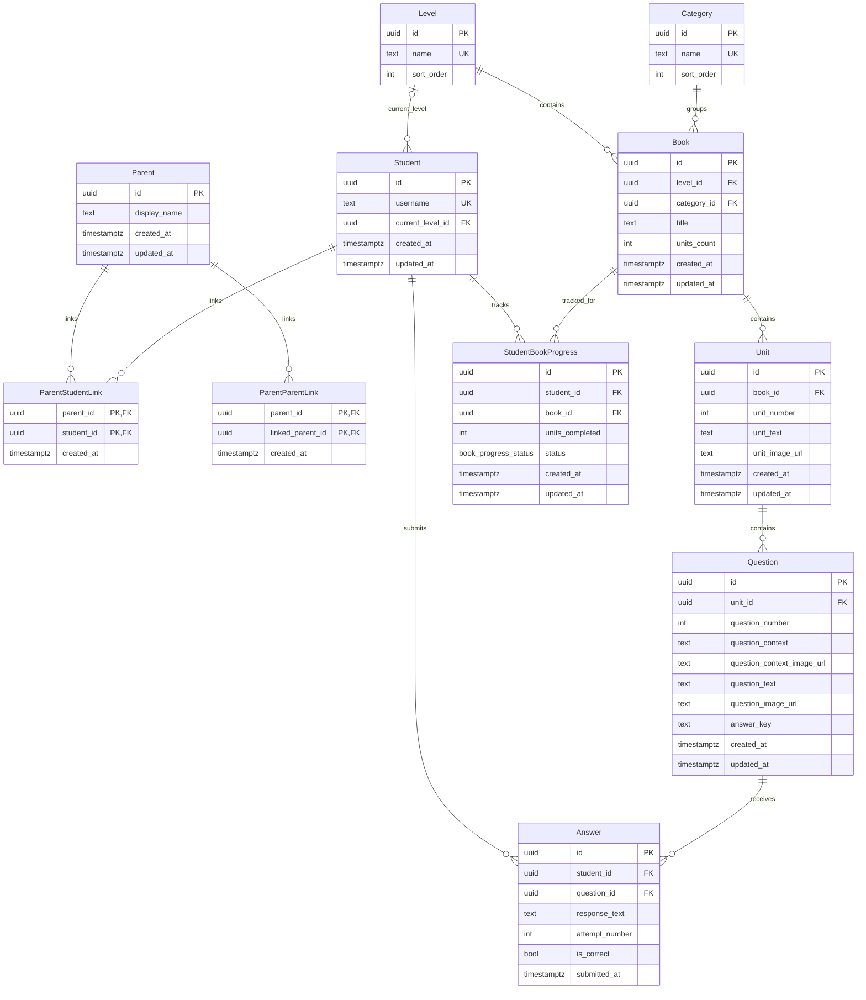

> Core ERD for books/curriculum data. See `docs/erd_math_facts.md` for the math facts subsystem.

```mermaid
erDiagram
    Parent ||--o{ ParentStudentLink : links
    Parent ||--o{ ParentParentLink : links
    Student ||--o{ ParentStudentLink : links
    Level o|--o{ Student : current_level
    Level ||--o{ Book : contains
    Category ||--o{ Book : groups
    Book ||--o{ Unit : contains
    Unit ||--o{ Question : contains
    Student ||--o{ Answer : submits
    Question ||--o{ Answer : receives
    Student ||--o{ StudentBookProgress : tracks
    Book ||--o{ StudentBookProgress : tracked_for

    Parent {
        uuid id PK
        text display_name
        timestamptz created_at
        timestamptz updated_at
        %% Auth lives in auth.users in Supabase users table.
    }

    Student {
        uuid id PK
        text username UK
        uuid current_level_id FK
        timestamptz created_at
        timestamptz updated_at
        %% Auth lives in auth.users in Supabase users table.
    }

    ParentStudentLink {
        uuid parent_id PK, FK
        uuid student_id PK, FK
        timestamptz created_at
    }

    ParentParentLink {
        uuid parent_id PK, FK
        uuid linked_parent_id PK, FK
        timestamptz created_at
    }

    Level {
        uuid id PK
        text name UK
        int sort_order
    }

    Category {
        uuid id PK
        text name UK
        int sort_order
    }

    Book {
        uuid id PK
        uuid level_id FK
        uuid category_id FK
        text title
        int units_count
        timestamptz created_at
        timestamptz updated_at
    }

    Unit {
        uuid id PK
        uuid book_id FK
        int unit_number
        text unit_text
        text unit_image_url
        timestamptz created_at
        timestamptz updated_at
    }

    Question {
        uuid id PK
        uuid unit_id FK
        int question_number
        text question_context
        text question_context_image_url
        text question_text
        text question_image_url
        text answer_key
        timestamptz created_at
        timestamptz updated_at
    }

    Answer {
        uuid id PK
        uuid student_id FK
        uuid question_id FK
        text response_text
        int attempt_number
        bool is_correct
        timestamptz submitted_at
    }

    StudentBookProgress {
        uuid id PK
        uuid student_id FK
        uuid book_id FK
        int units_completed
        book_progress_status status
        timestamptz created_at
        timestamptz updated_at
    }
```
