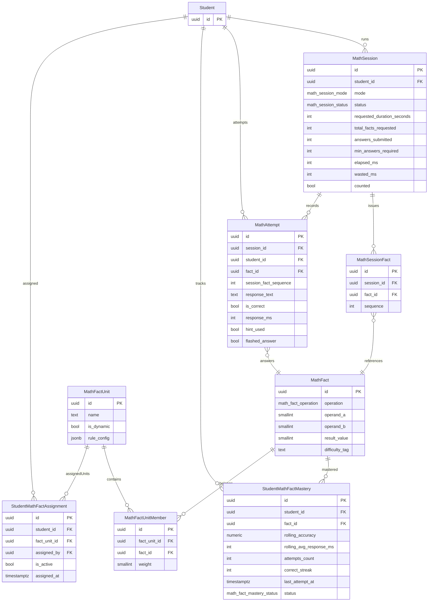

```mermaid
erDiagram
    Student ||--o{ MathSession : runs
    MathSession ||--o{ MathSessionFact : issues
    MathSessionFact }o--|| MathFact : references
    MathSession ||--o{ MathAttempt : records
    MathAttempt }o--|| MathFact : answers
    Student ||--o{ MathAttempt : attempts
    Student ||--o{ StudentMathFactMastery : tracks
    MathFact ||--o{ StudentMathFactMastery : mastered
    MathFactUnit ||--o{ MathFactUnitMember : contains
    MathFact ||--o{ MathFactUnitMember : belongs
    Student ||--o{ StudentMathFactAssignment : assigned
    MathFactUnit ||--o{ StudentMathFactAssignment : assignedUnits

    Student {
        uuid id PK
    }

    MathFact {
        uuid id PK
        math_fact_operation operation
        smallint operand_a
        smallint operand_b
        smallint result_value
        text difficulty_tag
    }

    MathFactUnit {
        uuid id PK
        text name
        bool is_dynamic
        jsonb rule_config
    }

    MathFactUnitMember {
        uuid id PK
        uuid fact_unit_id FK
        uuid fact_id FK
        smallint weight
    }

    StudentMathFactAssignment {
        uuid id PK
        uuid student_id FK
        uuid fact_unit_id FK
        uuid assigned_by FK
        bool is_active
        timestamptz assigned_at
    }

    MathSession {
        uuid id PK
        uuid student_id FK
        math_session_mode mode
        math_session_status status
        int requested_duration_seconds
        int total_facts_requested
        int answers_submitted
        int min_answers_required
        int elapsed_ms
        int wasted_ms
        bool counted
    }

    MathSessionFact {
        uuid id PK
        uuid session_id FK
        uuid fact_id FK
        int sequence
    }

    MathAttempt {
        uuid id PK
        uuid session_id FK
        uuid student_id FK
        uuid fact_id FK
        int session_fact_sequence
        text response_text
        bool is_correct
        int response_ms
        bool hint_used
        bool flashed_answer
    }

    StudentMathFactMastery {
        uuid id PK
        uuid student_id FK
        uuid fact_id FK
        numeric rolling_accuracy
        int rolling_avg_response_ms
        int attempts_count
        int correct_streak
        timestamptz last_attempt_at
        math_fact_mastery_status status
    }
```
